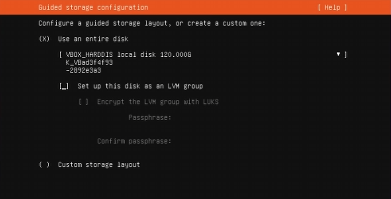

---
date: 2025-02-09
draft: false
title: 'How to set up your own home server'
cover:
  image: 'image-1.png'
  # can also paste direct link from external site
  # ex. https://i.ibb.co/K0HVPBd/paper-mod-profilemode.png
  alt: "<alt text>"
  caption: "<text>"
  relative: false
---

## Why setup a home server
A home server is in my opinion the best thing that you can do with old computers and hardware that just sits there doing nothing in your home. It started with me first finding this old laptop with a broken screen and keyboard which I couldnt use any more. Im sure all of us have this piece of ancient hardware that runs Windows 10 at 70% cpu utilisation and hasnt seen the light of day since the pandemic. If the hardware works, then linux works, and if linux works then you can use it to stream movies and music from your server to all your devices. 

## Prerequisites
1. *A Computer* with good storage and cpu capabilities; raspberry pi will also do

2. Wifi router with an *ethernet cable*

3. *USB* (it will be formatted)


## Setting up a basic home server
### Step 1
Download the ubuntu server iso file from <a href="https://ubuntu.com/download/server" target="_blank">here</a> and install <a href="https://ubuntu.com/download/server" target="_blank">balena etcher</a> or rufus to burn the iso file onto your USB. 
- *Make sure that you dont have any important data on the USB drive and then format it*

Use balena etcher and then burn the iso file onto the disk.

Take your soon-to-be home server and connect it to an ethernet cable and a power supply(keep in mind that they need to be connected throughout the operation of your homeserver ((I've had them plugged it for 50 days continuously now))) 

### Step 2
Restart the system and enter the BIOS (usually by pressing F2, F12, DEL, or ESC during startup).
Now set your USB drive as the primary boot device and save the changes.
Restart your device and Ubuntu server installation should pop up on your screen.

Follow the on-screen instructions and select the options you want... dont worry, most of these can be changed later. 

* Note down the username and password that you create* we will need this throughout the setup

One important step is to **uncheck** the option *Set up this disk as an LVM group* 


**Install docker when it prompts you to choose which packages to install. This will allow you to skip step 6**

### Step 3
Since you are connected to the home wifi via the ethernet cable, we need to reserve the ip address of your server so that it doesnt change when new devices are connected or when your router reboots.

To do that we go into your router settings by typing the address 192.168.0.1 into your browser.
Login and go to the DHCP server settings.

In the DHCP server settings go to the address reservation section and find your server's MAC address and reserve it. You can find your server's MAC address by typing **ifconfig** on your home server.

*Each router has different names for this so you'll have to find this on your own. This method only works for TP-link routers.*

### Step 4
Now we can access your server using others devices connected to the home network. 

Go to the terminal in your laptop and then type the following:

```bash
$ ssh <user-name>@<server-ip>
```

If your device is connected to the network properly it will then ask you to enter your password.
After entering the correct password you will then be able to use your server's terminal!

### Step 5 Installing samba 

Samba can be used to access your files and folders using other devices on your home network. Install samba on your home server using this command:
```bash
$ sudo apt install samba
```
After installing samba, edit the configuration to set some rules to access your server
```bash
$ sudo nano /etc/samba/smb.conf
```
go to the complete bottom of the file and then type:
```bash
[SharedFolder]
path = /home/username/shared
browseable = yes
writable = yes
guest ok = no
valid users = username
```
close the file by pressing Ctrl+X and then press y to save the file without changing the name.

Now restart samba 
```bash
$ sudo systemctl restart smbd
```

On your windows laptop you can access samba by opening File Explorer and right-clicking on Network-> Map Network Drive.

When it prompts you to enter the folder type **\\<server-ip>\** and make sure to include all the 3 backslashes.

it should then connect to your server and open up a new window which contains the files on your server. You can test this out by creating a file on your server using the terminal and then refreshing the page on the file explorer.

### Step 6 Installing docker 

There are multiple ways to install docker. The simplest method is by using the <a href="https://docs.docker.com/engine/install/ubuntu/#install-using-the-repository" target="_blank">apt repository</a>.

Sometimes, errors occur and troubleshooting is required so it would be best to follow the docs. 

If you want a quick refresher on docker, you can watch my video <a href="https://youtu.be/uaiUkfBGdUE" target="_blank">here</a>.

After installing docker you need to install docker-compose which is what we will be using.

(Optional) You can set up portainer which is basically a GUI for maintaining docker containers on your server. You can do that by following <a href="https://www.youtube.com/watch?v=4y0ksWu4wHw" target="_blank">this video</a>. 

### Step 7 Installing Jellyfin 
After making sure that docker and docker-compose is set up successfully on your system you can then proceed to install jellyfin.

Jellyfin is a service which runs on port 8096. It can be used to play media such as movies, shows, music and even audiobooks. It supports a wide variety of codecs and formats and even lets you do live transcoding to play on different devices.

To install jellyfin, go to your home directory and then create a directory called **docker/jellyfin** so we're creating the jellyfin sub-directory within the docker directory. Go to the jellyfin directory and create 2 directories - **config** and **cache**  using the mkdir command. Then create a file called **docker-compose.yml** using either vim or nano. Inside the file, paste the following lines:

```bash
services:
  jellyfin:
    image: jellyfin/jellyfin
    container_name: jellyfin
    user: 1000:1000
    network_mode: 'host'
    volumes:
      - ./config:/config
      - ./cache:/cache
      - type: bind
        source: /home/schizoid-man/docker/qbittorrent/downloads
        target: /media
        read_only: true
    restart: 'unless-stopped'
    # Optional - may be necessary for docker healthcheck to pass if running in host network mode
    extra_hosts:
      - 'host.docker.internal:host-gateway'
```

In case of any updates, follow the instructions <a href="https://jellyfin.org/docs/general/installation/container#using-docker-compose" target="_blank">here</a>. 

After creating and saving the docker-compose.yml file run the following command:
```bash
docker-compose up -d
```

Now, open up your browser and type the ipv4 address of your server followed by a :8096 at the end to denote the port 8096 *<server-ip-address>:8096*. If the jellyfin logo pops up then you have successfully installed jellyfin on your home server. Follow the instructions to set up the jellyfin environment and make sure that you enter the username and password of the root user that created at first so that you remember it.


## Enjoy!

Congratulations! You’ve successfully set up your own Jellyfin media server using Docker. 

Sail the high seas and enjoy high quality media which you can watch at any time, for free! You just got your own personal Netflix!! Whether you're binge-watching classics, organizing your vast anime collection, or streaming home videos that totally aren’t embarrassing, your media is now truly yours.

If things break (and at some point, they will), don’t panic— Docker makes it easy to debug and fix it!!

If you need more help, feel free to <a href="https://schizoid-man.github.io/" target="_blank">contact me</a> for further help!

There's so much more you can do using your home server... I might make a blog/video for the advanced setup. Once you get into the home-server space, its a never ending rabbit hole. There's always more optimised setups and more functionalities to add. Adieu! And all the best!!


